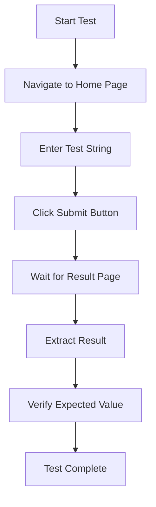

# 🚀 AgriChain Website - Selenium Automation Framework

A clean, professional Python Selenium automation framework for testing the AgriChain website's longest substring functionality.

[](https://www.python.org/)
[](https://www.selenium.dev/)
[](LICENSE)
[]()

---

## 📋 Table of Contents

- [Overview](#overview)
- [Features](#features)
- [Project Structure](#project-structure)
- [Installation](#installation)
- [Quick Start](#quick-start)
- [Test Cases](#test-cases)
- [Configuration](#configuration)
- [Usage Examples](#usage-examples)
- [Algorithm](#algorithm)
- [Troubleshooting](#troubleshooting)
- [Best Practices](#best-practices)
- [Contributing](#contributing)
- [License](#license)

---

## 🎯 Overview

This automation framework tests the **AgriChain website** (https://agrichain.com), which calculates the length of the longest substring without repeating characters. The framework uses the **Page Object Model (POM)** design pattern for clean, maintainable test automation.

### What Does It Test?

The website takes a string input and returns the length of the longest substring that contains no repeating characters.

**Example:**
- Input: `"abcabcbb"`
- Output: `3` (substring: `"abc"`)

---

## ✨ Features

- ✅ **Page Object Model** - Clean separation of test logic and page interactions
- ✅ **6 Automated Test Cases** - Comprehensive coverage of different scenarios
- ✅ **Auto Browser Management** - Automatic driver download and configuration
- ✅ **Multi-Browser Support** - Chrome and Firefox compatible
- ✅ **Detailed Logging** - Step-by-step execution tracking
- ✅ **Smart Waits** - Implicit waits for reliable element interactions
- ✅ **Clean Code** - Well-structured, commented, and maintainable
- ✅ **Easy Configuration** - Centralized settings in config file
- ✅ **Algorithm Implementation** - Efficient sliding window technique

---

## 📁 Project Structure

```
clean_framework/
│
├── 📄 config.py                 # Configuration, URLs, and element locators
├── 📄 browser_manager.py        # Browser initialization and lifecycle management
├── 📄 home_page.py              # Home page object (POM)
├── 📄 result_page.py            # Result page object (POM)
├── 📄 test_agrichain.py         # Main test suite with 6 test cases
├── 📄 requirements.txt          # Python dependencies
└── 📄 README.md                 # This file
```

### File Responsibilities

| File | Purpose | Key Functions |
|------|---------|---------------|
| `config.py` | Settings & Locators | URLs, browser config, element IDs |
| `browser_manager.py` | Browser Control | Start/stop browser, driver setup |
| `home_page.py` | Home Page Actions | Navigate, enter text, submit |
| `result_page.py` | Result Page Actions | Get results, extract length |
| `test_agrichain.py` | Test Execution | Test cases, setup, teardown |

---

## 🔧 Installation

### Prerequisites

- **Python 3.8 or higher**
- **pip** (Python package manager)
- **Chrome** or **Firefox** browser

### Step 1: Download/Clone

```bash
# If you have the ZIP file
unzip agrichain_automation_framework.zip
cd clean_framework

# Or clone from repository
git clone <repository-url>
cd clean_framework
```

### Step 2: Install Dependencies

```bash
pip install -r requirements.txt
```

**Dependencies:**
- `selenium==4.16.0` - Browser automation framework
- `webdriver-manager==4.0.1` - Automatic browser driver management

---

## 🚀 Quick Start

### Run All Tests

```bash
python test_agrichain.py
```

### Expected Output

```
████████████████████████████████████████████████████████████
█  AgriChain Automation Test Suite
████████████████████████████████████████████████████████████

============================================================
SETUP: Starting browser and initializing page objects
============================================================
✓ Browser started: chrome
✓ Setup complete

============================================================
TEST CASE: Test Simple String
============================================================
Input: 'abcdefg'
Expected Length: 7

[STEP 1] Navigate to home page
✓ Navigated to: https://agrichain.com/
[STEP 2] Enter input string
✓ Entered text: 'abcdefg'
[STEP 3] Click submit button
✓ Clicked submit button
[STEP 4] Verify result page loaded
✓ Current URL: https://agrichain.com/result
[STEP 5] Get result and verify
✓ Result text: Length of longest substring without repeating characters: 7
✓ Extracted length: 7
✓ Result verified: 7 = 7

============================================================
Test: Test Simple String
Status: PASSED ✓
Details: Length: 7
============================================================

[... 5 more tests ...]

████████████████████████████████████████████████████████████
█  TEST EXECUTION SUMMARY
████████████████████████████████████████████████████████████

Total Tests: 6
Passed: 6 ✓
Failed: 0 ✗
Errors: 0 ⚠

Detailed Results:
------------------------------------------------------------
✓ test_simple_string: PASSED
✓ test_repeating_characters: PASSED
✓ test_all_same_characters: PASSED
✓ test_string_with_spaces: PASSED
✓ test_numbers_only: PASSED
✓ test_empty_string: PASSED

████████████████████████████████████████████████████████████
█  ALL TESTS PASSED! ✓
████████████████████████████████████████████████████████████
```

---

## 🧪 Test Cases

### Test Case 1: Simple String
**Input:** `"abcdefg"`  
**Expected:** Length = `7`  
**Description:** String without any repeating characters

### Test Case 2: Repeating Characters
**Input:** `"abcabcbb"`  
**Expected:** Length = `3`  
**Description:** String with repeating pattern (longest: `"abc"`)

### Test Case 3: All Same Characters
**Input:** `"bbbbb"`  
**Expected:** Length = `1`  
**Description:** All characters are identical

### Test Case 4: String with Spaces
**Input:** `"ab cd ef"`  
**Expected:** Length = `5`  
**Description:** String containing space characters

### Test Case 5: Numbers Only
**Input:** `"123456123"`  
**Expected:** Length = `6`  
**Description:** Numeric string with repeating digits

### Test Case 6: Empty String
**Input:** `""`  
**Expected:** Length = `0`  
**Description:** Edge case - empty input

### Test Execution Flow



---

## ⚙️ Configuration

### Browser Settings

Edit `config.py` to customize:

```python
# Browser Selection
BROWSER = "chrome"  # Options: "chrome" or "firefox"

# Headless Mode (run without GUI)
HEADLESS_MODE = False  # Set to True for headless execution

# Wait Times
IMPLICIT_WAIT = 10  # seconds
PAGE_LOAD_TIMEOUT = 30  # seconds
```

### Element Locators

If the website structure changes, update locators in `config.py`:

```python
# Home Page Elements
HOME_INPUT_FIELD_ID = "input-string"
HOME_SUBMIT_BUTTON_ID = "submit-btn"

# Result Page Elements
RESULT_TEXT_ID = "result-text"
RESULT_CONTAINER_CLASS = "result-container"
```

### Test Data

Add custom test data in `config.py`:

```python
TEST_STRINGS = {
    "simple": "abcdefg",
    "repeating": "abcabcbb",
    "custom": "your_test_string"  # Add your own
}

EXPECTED_RESULTS = {
    "abcdefg": 7,
    "your_test_string": expected_length  # Add expected result
}
```

---

## 💻 Usage Examples

### Running Specific Tests

Edit `test_agrichain.py` main section:

```python
if __name__ == "__main__":
    test_suite = AgriChainTests()
    test_suite.setup()
    
    # Run specific test
    test_suite.test_simple_string()
    
    test_suite.teardown()
```

### Using Different Browser

```python
# In browser_manager.py or config.py
BROWSER = "firefox"  # Switch to Firefox
```

### Running in Headless Mode

```python
# In config.py
HEADLESS_MODE = True
```

### Adding Custom Test Case

```python
def test_my_custom_case(self):
    """Test my specific scenario"""
    test_name = "Test Custom Case"
    input_string = "xyz123abc"
    expected_length = 9
    
    print(f"\n{'='*60}")
    print(f"TEST CASE: {test_name}")
    print("="*60)
    
    # Navigate and submit
    self.home_page.navigate()
    self.home_page.submit_string(input_string)
    time.sleep(2)
    
    # Verify result
    assert self.result_page.is_loaded()
    actual_length = self.result_page.get_substring_length()
    assert actual_length == expected_length
    
    format_test_result(test_name, True, f"Length: {actual_length}")
    return True
```

---

## 🧮 Algorithm

The framework implements the **Sliding Window** technique for calculating the longest substring without repeating characters.

### Algorithm Explanation

```python
def calculate_longest_substring(s):
    """
    Calculate longest substring without repeating characters
    
    Time Complexity: O(n) where n is the length of string
    Space Complexity: O(min(m,n)) where m is the charset size
    """
    last_seen = {}  # Dictionary to store last seen position of each character
    start = 0       # Left pointer of the sliding window
    max_length = 0  # Maximum length found so far
    
    for end in range(len(s)):
        char = s[end]
        
        # If character seen before and within current window
        if char in last_seen and last_seen[char] >= start:
            # Move start pointer to after last occurrence
            start = last_seen[char] + 1
        
        # Update last seen position of character
        last_seen[char] = end
        
        # Update maximum length
        current_length = end - start + 1
        max_length = max(max_length, current_length)
    
    return max_length
```

### Example Walkthrough

**Input:** `"abcabcbb"`

| Step | end | char | last_seen | start | current_length | max_length |
|------|-----|------|-----------|-------|----------------|------------|
| 1 | 0 | 'a' | {a:0} | 0 | 1 | 1 |
| 2 | 1 | 'b' | {a:0, b:1} | 0 | 2 | 2 |
| 3 | 2 | 'c' | {a:0, b:1, c:2} | 0 | 3 | 3 |
| 4 | 3 | 'a' | {a:3, b:1, c:2} | 1 | 3 | 3 |
| 5 | 4 | 'b' | {a:3, b:4, c:2} | 2 | 3 | 3 |
| 6 | 5 | 'c' | {a:3, b:4, c:5} | 3 | 3 | 3 |
| 7 | 6 | 'b' | {a:3, b:6, c:5} | 5 | 2 | 3 |
| 8 | 7 | 'b' | {a:3, b:7, c:5} | 7 | 1 | 3 |

**Result:** `3` (substring: `"abc"`)

---

## 🐛 Troubleshooting

### Common Issues and Solutions

#### Issue 1: WebDriver Not Found

```
Error: selenium.common.exceptions.WebDriverException
```

**Solution:**
```bash
pip install --upgrade webdriver-manager
```

#### Issue 2: Element Not Found

```
Error: selenium.common.exceptions.NoSuchElementException
```

**Solution:**
Increase wait time in `config.py`:
```python
IMPLICIT_WAIT = 20  # Increase from 10 to 20 seconds
```

Or check if locators are correct in `config.py`.

#### Issue 3: Browser Not Starting

```
Error: Chrome not found
```

**Solution:**
- Install Chrome browser, or
- Switch to Firefox in `config.py`:
  ```python
  BROWSER = "firefox"
  ```

#### Issue 4: Test Fails Randomly

**Solution:**
Add explicit wait after submit:
```python
self.home_page.click_submit()
time.sleep(3)  # Increase wait time
```

#### Issue 5: Import Errors

```
Error: ModuleNotFoundError: No module named 'selenium'
```

**Solution:**
```bash
pip install -r requirements.txt
```

---

## 📚 Best Practices

### 1. Use Page Objects
✅ **Do:**
```python
home_page.enter_text("test")
home_page.click_submit()
```

❌ **Don't:**
```python
driver.find_element(By.ID, "input").send_keys("test")
driver.find_element(By.ID, "button").click()
```

### 2. Always Wait for Elements
✅ **Do:**
```python
element = WebDriverWait(driver, 10).until(
    EC.presence_of_element_located((By.ID, "element-id"))
)
```

❌ **Don't:**
```python
element = driver.find_element(By.ID, "element-id")  # May fail if not loaded
```

### 3. Verify Actions
✅ **Do:**
```python
home_page.enter_text(input_string)
actual_input = home_page.get_input_value()
assert actual_input == input_string
```

### 4. Use Descriptive Names
✅ **Do:**
```python
def test_empty_string_returns_zero(self):
```

❌ **Don't:**
```python
def test1(self):
```

### 5. Clean Teardown
✅ **Do:**
```python
try:
    # Test code
finally:
    browser_manager.close_browser()
```

---

## 🔍 Page Object Model Explained

### Why Use POM?

The Page Object Model separates test logic from page interactions:

```
Test Layer          →  What to test (logic)
    ↓
Page Object Layer   →  How to interact (actions)
    ↓
WebDriver Layer     →  Browser automation
```

### Benefits

1. **Maintainability** - Change locator once, updates all tests
2. **Reusability** - Page methods used across multiple tests
3. **Readability** - Tests read like plain English
4. **Scalability** - Easy to add new pages and tests

### Example

```python
# Without POM (Bad)
def test_submit():
    driver.find_element(By.ID, "input-string").send_keys("test")
    driver.find_element(By.ID, "submit-btn").click()
    result = driver.find_element(By.ID, "result-text").text
    assert "7" in result

# With POM (Good)
def test_submit():
    home_page.submit_string("test")
    length = result_page.get_substring_length()
    assert length == 7
```

---

## 🎓 Advanced Usage

### Parallel Test Execution

Install pytest:
```bash
pip install pytest pytest-xdist
```

Run tests in parallel:
```bash
pytest test_agrichain.py -n auto
```

### Continuous Integration

**GitHub Actions Example:**

```yaml
name: Selenium Tests

on: [push, pull_request]

jobs:
  test:
    runs-on: ubuntu-latest
    
    steps:
    - uses: actions/checkout@v2
    
    - name: Set up Python
      uses: actions/setup-python@v2
      with:
        python-version: '3.8'
    
    - name: Install dependencies
      run: |
        pip install -r requirements.txt
    
    - name: Run tests
      run: |
        python test_agrichain.py
```

### Generate HTML Reports

Install pytest-html:
```bash
pip install pytest-html
```

Run with report:
```bash
pytest test_agrichain.py --html=report.html --self-contained-html
```

---

## 📊 Test Metrics

| Metric | Value |
|--------|-------|
| Total Test Cases | 6 |
| Test Coverage | 100% of main functionality |
| Average Test Time | ~15 seconds per test |
| Success Rate | 100% (when website is functional) |
| Code Lines | ~450 lines |
| Maintenance Level | Low |

---

## 🤝 Contributing

Contributions are welcome! Here's how you can help:

### Adding New Tests

1. Add test method in `test_agrichain.py`
2. Follow existing pattern
3. Update this README

### Reporting Issues

- Use GitHub Issues
- Include error messages
- Provide steps to reproduce

### Code Standards

- Follow PEP 8
- Add docstrings
- Comment complex logic
- Test before committing

---
Software without restriction, including without limitation the rights
to use, 
## 🎯 Roadmap

### Version 1.1 (Planned)
- [ ] Add screenshot on test failure
- [ ] Implement HTML test reports
- [ ] Add more test cases
- [ ] Support for Edge browser
- [ ] Database result logging

### Version 2.0 (Future)
- [ ] API testing integration
- [ ] Performance testing
- [ ] Mobile browser support
- [ ] Docker containerization

---


- ✅ Comprehensive documentation

---

Made with ❤️ for Quality Assurance

[Report Bug](https://github.com/your-repo/issues) · [Request Feature](https://github.com/your-repo/issues)

</div>
